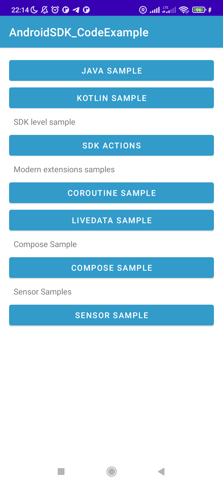
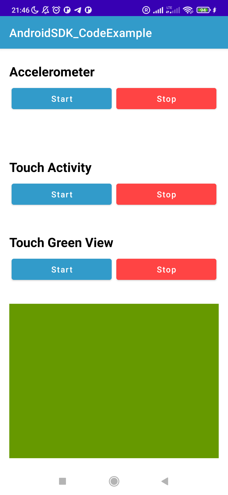
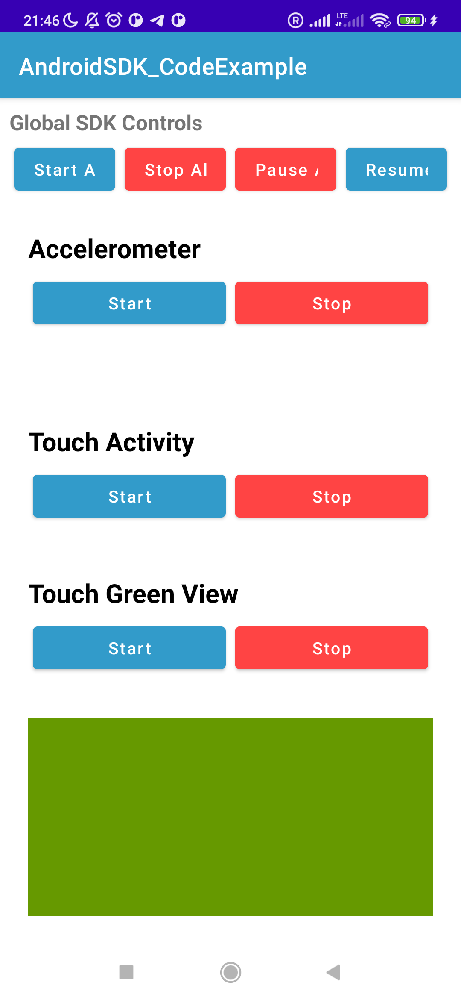
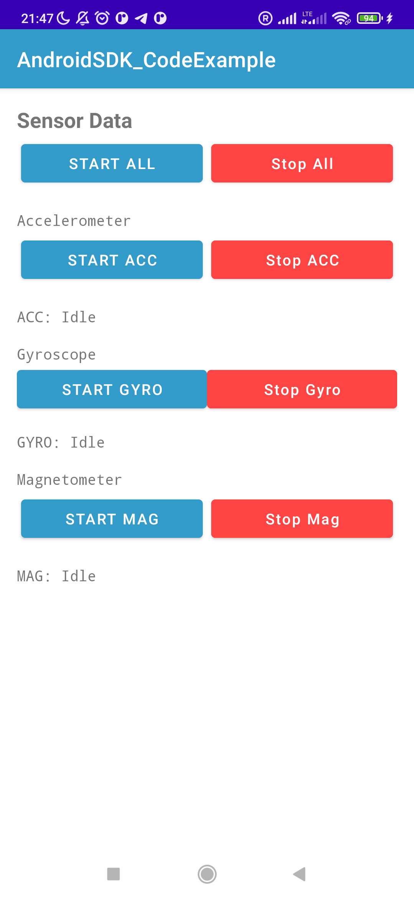
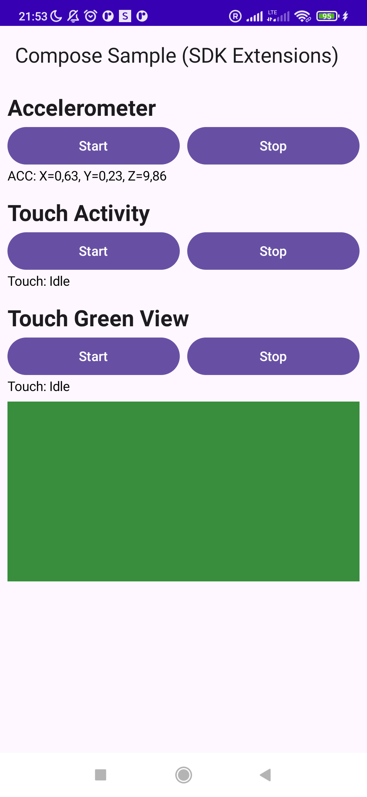

# Module UserBehaviorSDK

# Integration Guide: UserBehaviorSDK

## Table of Contents
1. [Design & Patterns](#design--patterns)
2. [Scalability & Integrations](#scalability--integrations)
3. [Introduction](#introduction)
4. [Modules](#modules)
5. [Prerequisites](#prerequisites)
6. [Setup Instructions](#setup-instructions)
   - [Step 1: Install Dependencies](#step-1-install-dependencies)
   - [Step 2: Initialize the SDK](#step-2-initialize-the-sdk)
   - [Step 3: Using the SDK](#step-3-using-the-sdk)
7. [Configuration](#configuration)
8. [Jetpack Compose Integration](#jetpack-compose-integration)
9. [Screenshots](#screenshots)
10. [Demo](#demo)
11. [API Reference](#api-reference)
12. [Testing Recommendations](#testing-recommendations)
13. [Securing the Application with ProGuard/R8 Rules](#securing-the-application-with-proguardr8-rules)
14. [Documentation Generation](#documentation-generation)
15. [Code Conventions](#code-conventions)
16. [Areas for Enhancement](#areas-for-enhancement)
17. [Common Errors & Troubleshooting](#common-errors--troubleshooting)
18. [FAQs](#faqs)
19. [Support](#support)

---

## Design & Patterns

This SDK follows a few deliberate design patterns to keep the public API small, testable, and stable
while allowing flexible implementations internally:

- Facade Pattern
    - `UserBehaviorCoreSDK` acts as the public facade for the SDK. Consumers interact only with this
      single entry point to create/fetch managers and perform high-level operations. The facade
      hides the details of the concrete manager implementations and wiring.

- Contracts / Interfaces ("Contractor")
    - Managers are exposed via well-defined interfaces (for example `IAccelerometerManager`,
      `ITouchManager`) instead of concrete classes. This contract-based approach prevents leaking
      internal implementation details and makes it easy to replace or mock managers in tests.
    - Factory methods on the facade (`getAccelerometerManager(...)`,
      `fetchOrCreateActivityTouchManager(...)`) return the contract types rather than concrete
      implementations.

- Builder Pattern
    - Configuration objects and user-like entities use builder-style APIs (for example
      `AccelerometerConfig`, `TouchConfig`, or a potential `UserBuilder`) so callers can fluently
      construct complex options without many overloaded constructors. Builders make configuration
      explicit and easier to extend.

- Proxy Pattern for Logging
    - The SDK can wrap internal managers with proxy decorators that add cross-cutting concerns such
      as logging or metrics. This proxy-based approach keeps the core logic clean and enables
      enabling/disabling logging (or swapping logger implementations) without changing manager code.
    - In the sample app we show wiring to Timber and `com.orhanobut:logger` as examples; a proxy
      layer is used in the SDK to forward calls and inject logging behavior.

Why these patterns?

- They keep the public API stable and small.
- They enforce separation of concerns (configuration, runtime behavior, and cross-cutting concerns
  like logging are decoupled).
- They improve testability by allowing easy mocking or replacement of managers.

---

## Scalability & Integrations

We validated the SDK's scalability and compatibility with modern Android architectures by integrating it across several patterns and tooling:

- LiveData: `LiveDataViewModel` exposes SDK events as LiveData for classic View-based UIs.
- Kotlin Coroutines / Flow: `CoroutineViewModel` exposes StateFlow/Flow, enabling idiomatic coroutine-based consumption and Compose-friendly state handling.
- Jetpack Compose: `userBehaviorSDK-Compose` provides `ProvideUserBehaviorSDK` and `LocalUserBehaviorCoreSDK` so composables can access the SDK directly.
- SensorsManager abstraction: we introduced a `SensorsManager`-style abstraction to centralize sensor registration, lifecycle, and scaling across many sensor types (accelerometer, gyroscope, magnetometer, etc.).

These integrations demonstrate the SDK is usable in both legacy (LiveData) and modern (Flow + Compose) stacks and can be scaled across modules and sensor types without exposing internal managers directly.

---

## Introduction

This guide provides step-by-step instructions for integrating the **UserBehaviorSDK** into your
Android project. Follow these instructions to quickly get started collecting sensor and touch data
with a modern, scalable, and easy-to-use API.

---

## Modules

This project is organized into several modules to promote separation of concerns and scalability:

| Module                    | Description                                                                                              |
|---------------------------|----------------------------------------------------------------------------------------------------------|
| `UserBehaviorSDK`         | The core module containing the main SDK logic, managers, and configuration builders.                     |
| `userBehaviorSDK-Ktx`     | Provides Kotlin Coroutine extensions (`Flow`) for collecting data from managers asynchronously.          |
| `userBehaviorSDK-Compose` | Provides Jetpack Compose extensions (`remember...`, `Modifier.collect...`) for idiomatic UI integration. |
| `app`                     | A sample application demonstrating how to use the SDK with both Views and Jetpack Compose.               |

---

## Prerequisites

Before you begin the integration process, make sure you have the following:

- Android Studio & a modern Android project.
- Access to your [system’s] configuration settings.
- Android Studio and a modern Android toolchain (JDK 11+ recommended).
- Optional: a DI framework (Koin is used in the samples).
- In the future, an API Key from the [UserBehaviorSDK] service will be required.

## Setup Instructions

### Step 1: Install Dependencies

Add the SDK as a dependency to your app-level `build.gradle` or `build.gradle.kts` file.

If you're working inside this repo the modules are already included. If you publish the SDK
separately, consumers would add a Gradle dependency. Example module inclusion (local):

In `settings.gradle`:

```gradle
include ':app', ':UserBehaviorSDK', ':userBehaviorSDK-Ktx', ':userBehaviorSDK-Compose'
```

In `app/build.gradle` (example):

```kotlin
dependencies {
    implementation(project(":UserBehaviorSDK"))
    implementation(project(":userBehaviorSDK-Ktx"))
    implementation(project(":userBehaviorSDK-Compose"))

    // optional dev helpers used in the sample
    implementation("io.insert-koin:koin-android:3.4.0")
    implementation("com.jakewharton.timber:timber:5.0.1")
    implementation("com.orhanobut:logger:2.2.0")
}
```

### Step 2: Initialize the SDK

The SDK's main entrypoint is `UserBehaviorCoreSDK`. Initialize it once (for example in your
Application class) and provide it via your DI container.
The main entry point to the SDK is `UserBehaviorCoreSDK`. The best practice is to initialize it once
and provide it via a dependency injection framework like Koin or Hilt.

Koin + Sample `Application` example:

> Note: If you use Compose, ensure Compose library versions are compatible with your Android Gradle
> Plugin (AGP). See the Compatibility note in Troubleshooting.

**Example: Initializing in your `Application` class (or DI module):**

```kotlin
class SampleApp : Application() {
    override fun onCreate() {
        super.onCreate()

        // optional: init loggers for development
        if (BuildConfig.DEBUG) {
            Timber.plant(Timber.DebugTree())
            com.orhanobut.logger.Logger.addLogAdapter(com.orhanobut.logger.AndroidLogAdapter())
        }

        startKoin {
            androidContext(this@SampleApp)
            modules(appModule)
        }
    }
}

val appModule = module {
    single {
        UserBehaviorSDKConfig.Builder().setDebugMode(true).setLogLevel(
            LogLevel.DEBUG
        ).setLoggingEnabled(true).build()
    }

    single { (app: Application) ->
        UserBehaviorCoreSDK.Builder(app.applicationContext)
            .withConfig(get())
            .addLogger(CustomLogger())
            .addLogger(TimberLogger())
            .addLogger(CustomOrhanLogger())
            .build()
    }
}
```

### Step 3: Using the SDK

Common patterns:

- Obtain `UserBehaviorCoreSDK` from DI: `val sdk: UserBehaviorCoreSDK by lazy { get() }` (Koin) or
  inject via your DI framework.
- Create managers:
    - `sdk.getAccelerometerManager()`
    - `sdk.fetchOrCreateActivityTouchManager(activity)`
    - `sdk.createTouchManager()`
- Configure managers, add listeners and error listeners, then call `start()` / `stop()`.

Example usage:

#### Legacy Listener-Based (Java/Kotlin)

```kotlin
val accel = sdk.getAccelerometerManager()
accel.setLoggingEnabled(true)
accel.addListener(object : AccelerometerListener {
    override fun onSensorChanged(e: AccelerometerEventModel) { /* handle */ }
    override fun onAccuracyChanged(a: AccuracyChangedModel) { /* handle */ }
})
accel.addErrorListener { /* handle BaseUserBehaviorException */ }
accel.start()
```

#### Modern Coroutine-Based (Kotlin + Flow)

For modern Kotlin applications, use the `-ktx` extensions to collect data via `Flow`. This is the recommended approach.

```kotlin
// In a CoroutineScope (e.g., a ViewModel)
viewModelScope.launch {
    val accelManager = sdk.getAccelerometerManager()
    accelManager.start()

    // The flow emits a Result, making error handling seamless
    accelManager.accelerometerResultFlow().collect { result ->
        result.onSuccess { event ->
            // Handle AccelerometerResult.SensorChanged or .AccuracyChanged
        }.onFailure { error ->
            // Handle exceptions
        }
    }
}
```


**Global SDK Actions & Observables**

The `UserBehaviorCoreSDK` provides global methods to control all registered managers at once, as well as observe global events.

- **Global Actions**:
  - `sdk.startAll()`: Starts all managers.
  - `sdk.stopAll()`: Stops all managers.
  - `sdk.pauseAll()`: Pauses all managers.
  - `sdk.resumeAll()`: Resumes all managers.

This is useful for managing data collection based on application lifecycle events (e.g., in `onPause` or `onResume` of a base Activity).

- **Global Observables**:
  - `sdk.addGlobalErrorListener(...)`: Receive errors from *any* manager in a single listener.
  - `sdk.globalErrorsResultFlow()`: A Kotlin Flow that emits a `Result.failure` for any error from any manager.


---

## Configuration

Configuration objects included in the SDK:

- `AccelerometerConfig` — configuration for accelerometer manager (sampling rates, filters, etc.).
- `TouchConfig` — configuration for touch managers (debounce, view tracking options, etc.).

Each manager is initialized with a **default configuration**. You can override this default for specific instances by passing a custom config object when you fetch or create a manager.

**Example: Overriding the Default Configuration**

```kotlin
// 1. Get a manager using the default, built-in configuration
val defaultManager = sdk.getAccelerometerManager()

// 2. Create a custom configuration for a specific screen
val customConfig = AccelerometerConfig.Builder().setDebugMode(true).setLoggingEnabled(true).build()

// 3. Get a new or existing manager instance with the custom config applied
val customManager = sdk.getAccelerometerManager(customConfig)
```

This pattern allows you to set a general behavior for your app while fine-tuning data collection for specific features or screens as needed.

---

## Jetpack Compose Integration

The `userBehaviorSDK-Compose` module provides `ProvideUserBehaviorSDK` and a `CompositionLocal` to
access the SDK from composables.

Example:


The `userBehaviorSDK-Compose` module provides composable functions to make SDK integration seamless and lifecycle-aware. The most common pattern is to use the `remember...` hooks and collect the resulting `Flow` as state.

**Example: Displaying Accelerometer Data in a Composable**

```kotlin
@Composable
fun MySensorScreen() {
    // 1. This hook remembers the manager and handles its lifecycle (start/stop).
    val accelerometerManager = rememberAccelerometerManager()

    // 2. Collect the data flow and convert it into a State object.
    val accelerometerData by accelerometerManager
        .accelerometerResultFlow()
        .collectAsState(initial = null)

    // 3. Display the data. The Text will automatically update.
    Text(text = "Accelerometer: ${accelerometerData?.toMessage() ?: "Idle"}")
}

// Don't forget to provide the SDK instance at the root of your Compose hierarchy.
setContent {
    ProvideUserBehaviorSDK(sdk) {
        MySensorScreen()
    }
}
```

```kotlin
setContent {
    ProvideUserBehaviorSDK(sdk) {
        ComposeSampleScreen()
    }
}

@Composable
fun ComposeSampleScreen() {
    val sdk = LocalUserBehaviorCoreSDK.current
    // interact with sdk — create managers, collect flows, etc.
}
```

When using Compose, prefer `CoroutineViewModel` (Flow / StateFlow) in your composables and collect
state using `collectAsState()`.

---

## Screenshots
|Main Screen | LiveData Screen | SDK Actions Screen |
| :---: | :---: | :---: |
|  |  |  |

|  Sensors Screen | Compose Screen |
| :---: | :---: |
|  |  |


---


## Demo

See the `app` module for sample activities:

- `StartActivity` — navigation entry to samples.
- `JavaSampleActivity` — Java-based samples.
- `KotlinSampleActivity` — Compose-based Kotlin sample.
- `ComposeSampleActivity` — Compose sample showing manager controls.
- `CoroutineSampleActivity` — Flow-based sample.
- `LiveDataSampleActivity` — LiveData-based sample using `LiveDataViewModel`.

Run the sample app from Android Studio or via Gradle:

```bash
./gradlew :app:installDebug
```

---

## API Reference

This README is a quick integration reference. For API details consult the public API in
`UserBehaviorSDK` module sources and the Ktx helpers in `userBehaviorSDK-Ktx`.

Primary entry points

- `UserBehaviorCoreSDK` — main SDK instance and manager factory methods.
- Manager interfaces: `IAccelerometerManager`, `ITouchManager`, etc.
- Listener interfaces and models: `AccelerometerListener`, `TouchListener`,
  `AccelerometerEventModel`, `MotionEventModel`, `ManagerErrorModel`.

---

## Testing Recommendations

- Add unit tests for managers and ViewModel logic; use mocking libraries like MockK for Android
  components.
- Add instrumentation tests to verify lifecycle behavior and UI integration with real or simulated
  sensors.
- Test error handling paths from `ManagerErrorModel`.

---

## Securing the Application with ProGuard/R8 Rules

Add the following to `proguard-rules.pro` to avoid obfuscation of the SDK public API:

```proguard
-keep class com.github.adhamkhwaldeh.userBehaviorSDK.** { *; }
```

---

## Documentation Generation

The project uses KDoc and Dokka to generate documentation. To generate HTML docs for the SDK module:

```bash
./gradlew :UserBehaviorSDK:dokkaHtml
```

Adjust task names as configured in the module Gradle files.

---

## Code Conventions

- Use `detekt` and `ktlint` for code style.
- Keep public APIs stable and well-documented with KDoc.

---

## Areas for Enhancement

- Add more integration examples (geolocation, activity recognition).
- Improve CI with detekt/ktlint checks and unit/instrumentation test runs.
- Add examples for analytics / crash reporting integration.

---

## Common Errors & Troubleshooting

- AGP vs Compose dependency mismatch: some Compose libs require newer AGP. Pin `activity-compose` or
  upgrade AGP.
- Koin DI issues: ensure `startKoin { androidContext(...) }` runs in your `Application` and that
  `SampleApp` is registered in the manifest.
- `getKoin().get` / `androidContext(this)` not found from Java: prefer Kotlin for Koin DSL usage or
  use the Java-compatible Koin API.

---

## FAQs

Q: Where do I register activities?
A: Activities are registered in `app/src/main/AndroidManifest.xml`.

Q: How do I get sensor events in Compose?
A: Use `CoroutineViewModel` that exposes StateFlow, then collect via `collectAsState()` in your
composable.

---

## Support

Open an issue on the repository: https://github.com/adhamkhwaldeh/UserBehaviorSDK/issues
